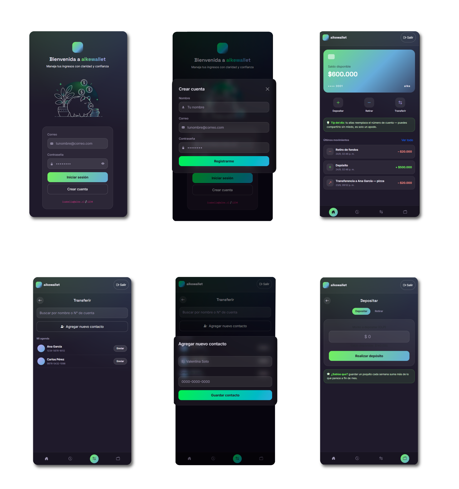

# Proyecto: Alke Wallet - Fundamentos del desarrollo Front-end

**Alke Wallet** es una aplicación web de billetera digital (wallet) desarrollada como proyecto integrador.
La aplicación permite a los usuarios crear una cuenta, gestionar sus activos financieros de manera segura y fácil de usar, simulando un entorno fintech real.La app permite a los usuarios crear una cuenta, gestionar sus activos financieros de manera segura y fácil de usar, simulando un entorno fintech real.

## 

Concepto trabajado
> *Tu dinero, tus decisiones, tu aprendizaje.*
Una billetera pensada para mujeres que están empezando a manejar su ingresos: claridad en cada movimiento, control sin vueltas, y un poco de aprendizaje en el camino — sin infantilizar, solo con confianza.

## Características Principales

- **Registro e Inicio de Sesión:** Creación de nuevas cuentas y acceso seguro mediante credenciales.
- **Administración de Fondos:** Visualización de saldo, depósitos y retiros.
- **Envío y Recepción de Fondos:** Simulación de transferencias a contactos.
- **Historial de Transacciones:** Registro completo de movimientos recientes.
  
*(Nota: La funcionalidad de registro de nuevos usuarios se agregó como complemento para enriquecer la estructura de diseño y la lógica de la aplicación).*

## Tecnologías

- **HTML5:** Estructura semántica de las pantallas.
- **CSS3:** Estilos personalizados y diseño responsivo.
- **JavaScript & jQuery:** Lógica de negocio, validaciones y manipulación del DOM.
- **Bootstrap:** Componentes visuales y grid system.

## Estructura del Proyecto

```
Alke_wallet/
├── index.html
├── login.html
├── register.html  (o el nombre de tu archivo para crear cuenta)
├── menu.html
├── deposit.html
├── sendmoney.html
├── transactions.html
├── css/
│   └── style.css
├── js/
│   ├── common.js
│   ├── login.js
│   ├── register.js (si creaste uno aparte)
│   ├── menu.js
│   ├── deposit.js
│   ├── sendmoney.js
│   └── transactions.js
└── assets/
    └── img/
```
## Capturas


